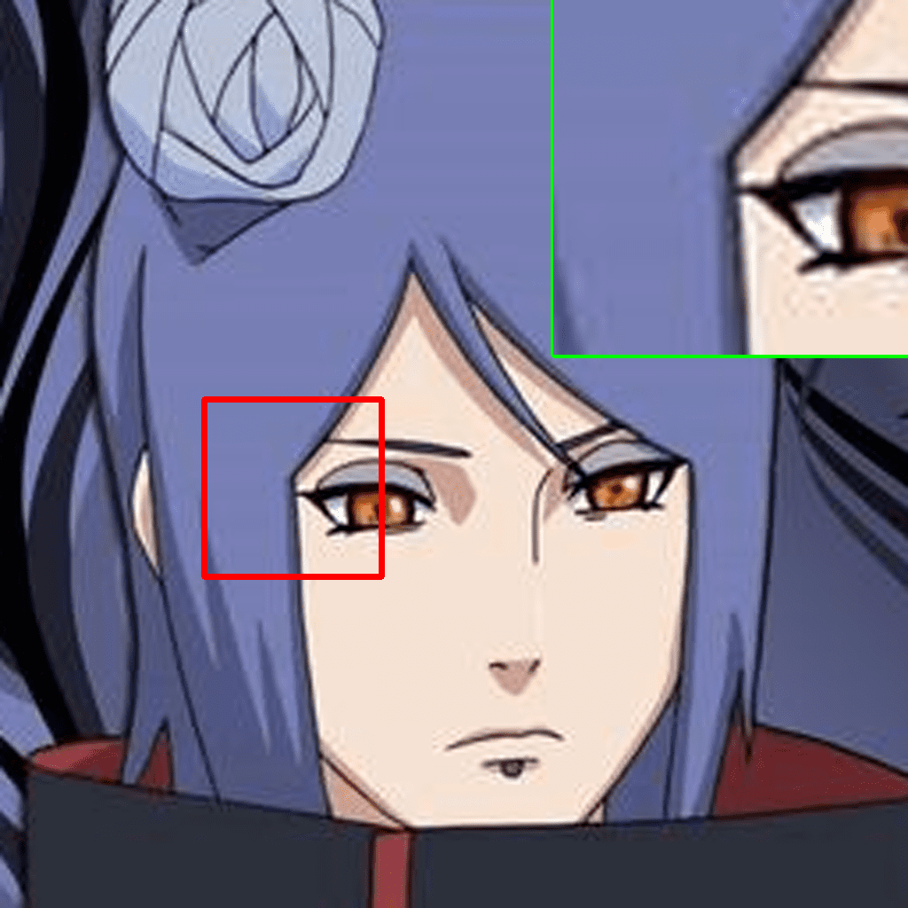
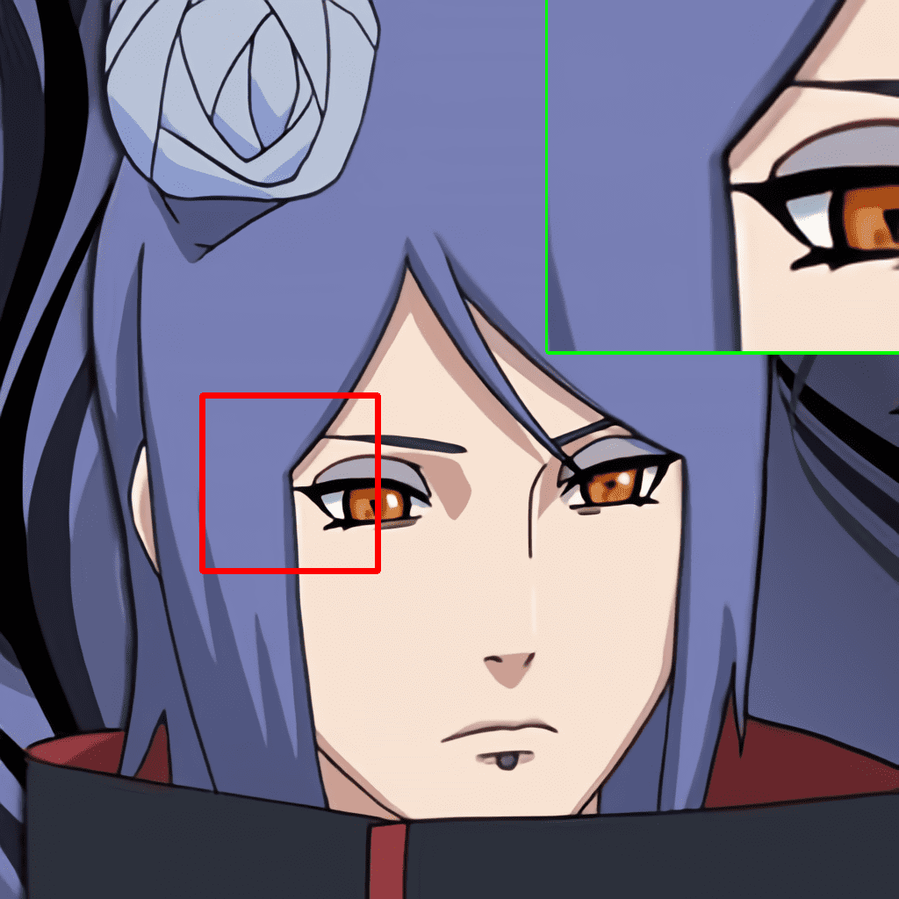

# Swin2SR @ ECCV 2022 AIM Workshop

## [Swin2SR: SwinV2 Transformer for Compressed Image Super-Resolution and Restoration](https://arxiv.org/abs/2209.11345)

[](https://arxiv.org/abs/2209.11345)


<br>

[Marcos V. Conde](https://scholar.google.com/citations?user=NtB1kjYAAAAJ&hl=en), [Ui-Jin Choi](https://scholar.google.com/citations?user=MMF5LCoAAAAJ&hl=en), [Maxime Burchi](https://scholar.google.com/citations?user=7S_l2eAAAAAJ&hl=en), [Radu Timofte](https://scholar.google.com/citations?user=u3MwH5kAAAAJ&hl=en)


[Computer Vision Lab, CAIDAS, University of Würzburg](https://www.informatik.uni-wuerzburg.de/computervision/home/)

MegaStudyEdu, South Korea

**We are looking for collaborators!  Collaborator를 찾고 있습니다!** 🇬🇧 🇪🇸 🇰🇷 🇫🇷 🇷🇴 🇩🇪 🇨🇳

------------------

**News 🚀🚀**

- [09/2022] Ongoing website and multiple demos creation. Feel free to contact us. Paper will be presented at AIM, ECCV 2022.

------------------

This is the official repository and PyTorch implementation of Swin2SR. We provide the supplementary material, code, pretrained models and demos. Swin2SR represents a possible improvement of the famous [SwinIR](https://github.com/JingyunLiang/SwinIR/) by [Jingyun Liang](https://jingyunliang.github.io/) (kudos for such an amazing contribution ✋). Our model achieves state-of-the-art performance in:

- classical, lighweight and real-world image super-resolution (SR)
- color JPEG compression artifact reduction
- compressed input super-resolution: top solution at the "[AIM 2022 Challenge on Super-Resolution of Compressed Image and Video](https://codalab.lisn.upsaclay.fr/competitions/5076)"


> Compression plays an important role on the efficient transmission and storage of images and videos through band-limited systems such as streaming services, virtual reality or videogames. However, compression unavoidably leads to artifacts and the loss of the original information, which may severely degrade the visual quality. For these reasons, quality enhancement of compressed images has become a popular research topic. While most state-of-the-art image restoration methods are based on convolutional neural networks, other transformers-based methods such as SwinIR, show impressive performance on these tasks.
In this paper, we explore the novel Swin Transformer V2, to improve SwinIR for image super-resolution, and in particular, the compressed input scenario. Using this method we can tackle the major issues in training transformer vision models, such as training instability, resolution gaps between pre-training and fine-tuning, and hunger on data. We conduct experiments on three representative tasks: JPEG compression artifacts removal, image super-resolution (classical and lightweight), and compressed image super-resolution. Experimental results demonstrate that our method, Swin2SR, can improve the training convergence and performance of SwinIR, and is a top-5 solution at the "AIM 2022 Challenge on Super-Resolution of Compressed Image and Video". 

<p align="center">
  <a href="https://arxiv.org/abs/2209.11345"></a>
</p>

------------------

#### Contents

1. [Training](#training)
1. [Testing](#testing)
1. [Results](#results)
1. [Citation and Acknowledgement](#citation-and-acknowledgement)
1. [Contact](#contact)

---------------------------------------------------

## Training


### Kaggle Starter guide and code 🔥


------

## Testing

### ClassicalSR 
```
python main_test_swin2sr.py --task classical_sr --scale 2 --training_patch_size 64 --model_path model_zoo/swin2sr/Swin2SR_ClassicalSR_X2_64.pth --folder_lq testsets/Set5/LR_bicubic/X2 --folder_gt testsets/Set5/HR
python main_test_swin2sr.py --task classical_sr --scale 4 --training_patch_size 64 --model_path model_zoo/swin2sr/Swin2SR_ClassicalSR_X4_64.pth --folder_lq testsets/Set5/LR_bicubic/X4 --folder_gt testsets/Set5/HR
```

### Lightweight
```
python main_test_swin2sr.py --task lightweight_sr --scale 2 --training_patch_size 64 --model_path model_zoo/swin2sr/Swin2SR_Lightweight_X2_64.pth --folder_lq testsets/Set5/LR_bicubic/X2 --folder_gt testsets/Set5/HR
```

------

## Results

We achieved state-of-the-art performance on classical, lightweight and real-world image Super-Resolution (SR), JPEG compression artifact reduction, and compressed input super-resolution. We use mainly the DIV2K Dataset and Flickr2K datasets for training, and for testing:  RealSRSet, 5images/Classic5/Set5, Set14, BSD100, Urban100 and Manga109  

🌎 **[All visual results of SwinIR can be downloaded here]()**. We also provide links to download the original datasets.
More details in our [paper](https://arxiv.org/abs/2209.11345).

<br>


|Compressed inputs | Swin2SR output|
|       :---       |     :---:     |
|  |  |
|  |  |
|  |  |
|  |  |

<br>

The **original evaluation datasets** can be downloaded from the following [Kaggle Dataset]()

🌎 **[All the qualitative samples can be downloaded here]()**


------


## Related Work

[SwinIR: Image Restoration Using Swin Transformer](https://arxiv.org/abs/2108.10257) by Liang et al, ICCVW 2021.

[Swin Transformer V2: Scaling Up Capacity and Resolution](https://arxiv.org/abs/2111.09883) by Liu et al, CVPR 2022.

[AIM 2022 Challenge on Super-Resolution of Compressed Image and Video](https://arxiv.org/abs/2208.11184) organized by Ren Yang.

[AISP: AI Image Signal Processing](https://github.com/mv-lab/AISP) by Marcos Conde and collaborators, 2022.

-----------------

## Citation and Acknowledgement

```
@inproceedings{conde2022swin2sr,
  title={{S}win2{SR}: SwinV2 Transformer for Compressed Image Super-Resolution and Restoration},
  author={Conde, Marcos V and Choi, Ui-Jin and Burchi, Maxime and Timofte, Radu},
  booktitle={Proceedings of the European Conference on Computer Vision (ECCV) Workshops},
  year={2022}
}
```

This project is released under the Apache 2.0 license. The codes are heavily based on [Swin Transformer](https://github.com/microsoft/Swin-Transformer) and [Swin Transformer](https://github.com/microsoft/Swin-Transformer) by [Ze Liu](https://scholar.google.com/citations?hl=en&user=9DbprTIAAAAJ). We also refer to codes in [KAIR](https://github.com/cszn/KAIR), [BasicSR](https://github.com/xinntao/BasicSR) and [SwinIR](https://github.com/JingyunLiang/SwinIR/). Please also follow their licenses. Thanks for their awesome works.


## Contact

Marcos Conde (marcos.conde-osorio@uni-wuerzburg.de) and Ui-Jin Choi are the contact persons. Please add in the email subject "swin2sr".
