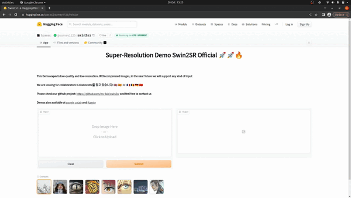
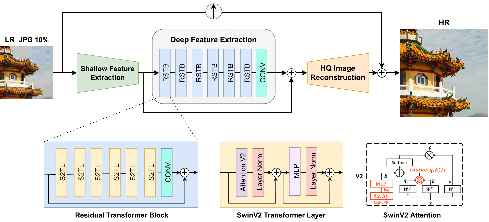
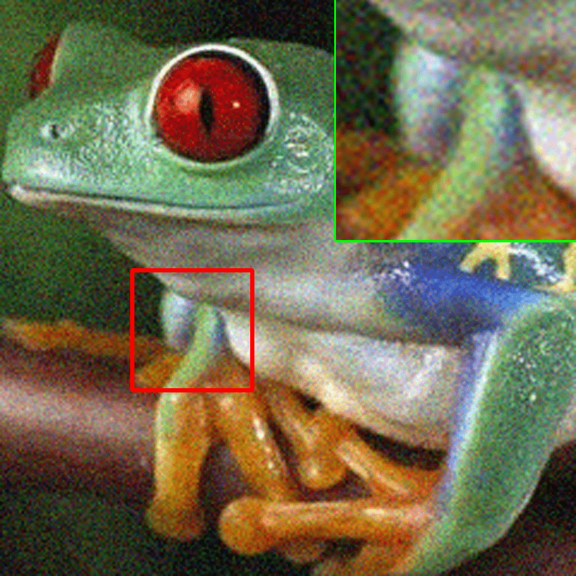
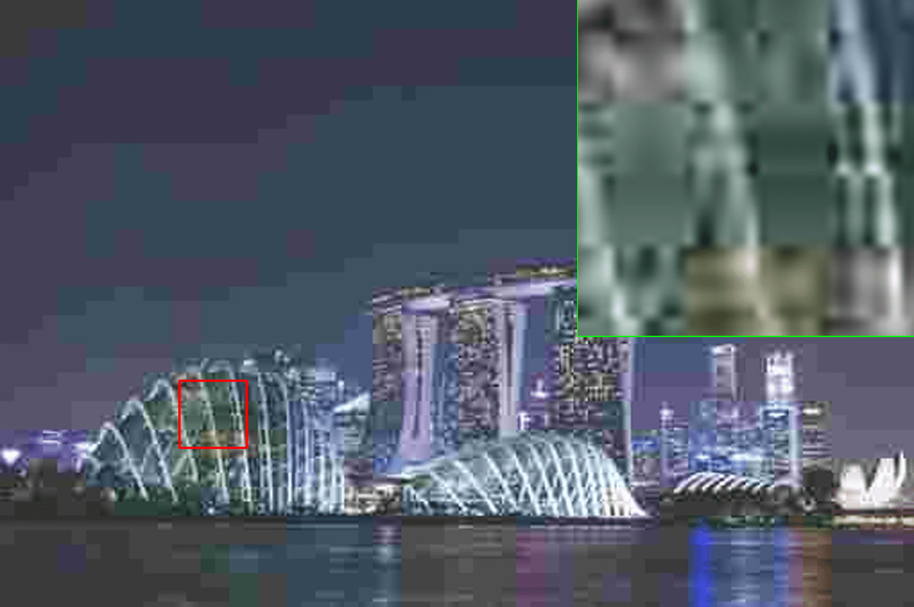
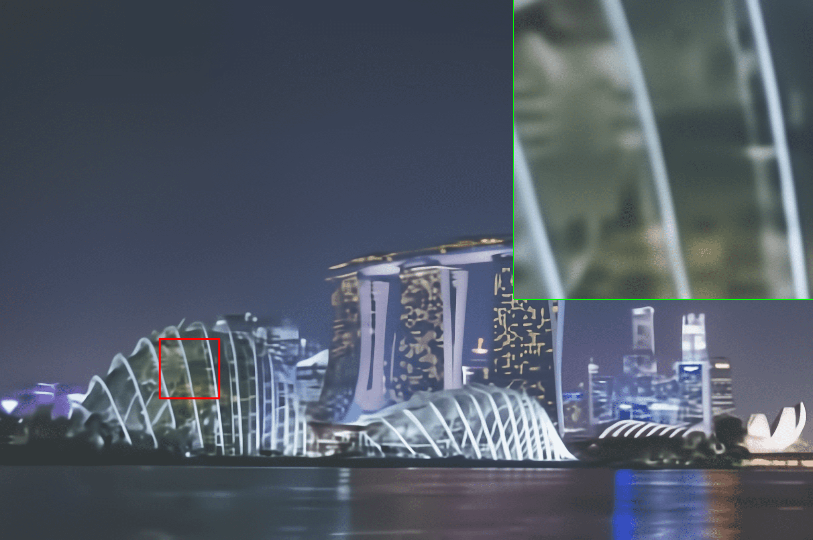
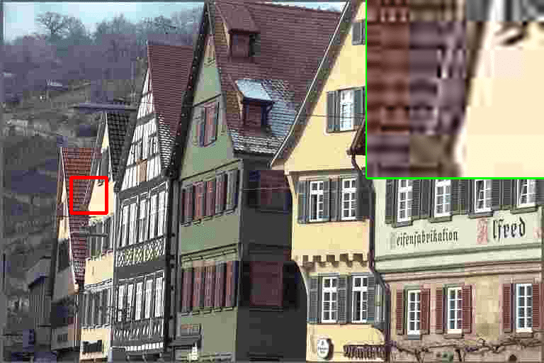
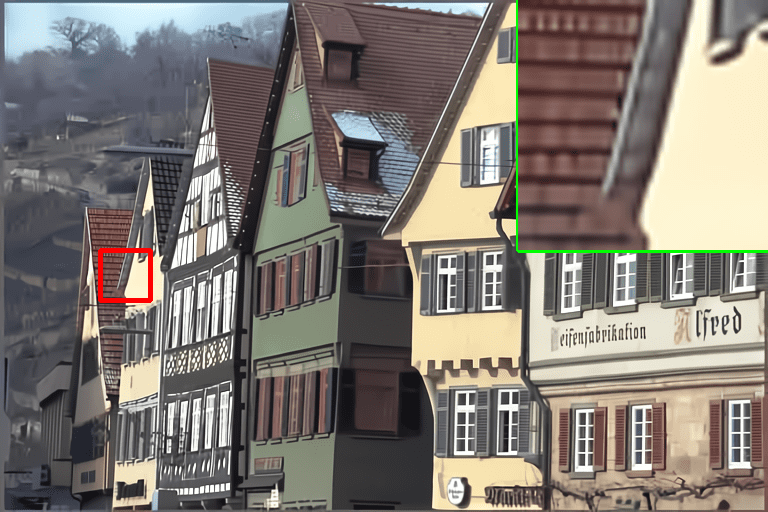
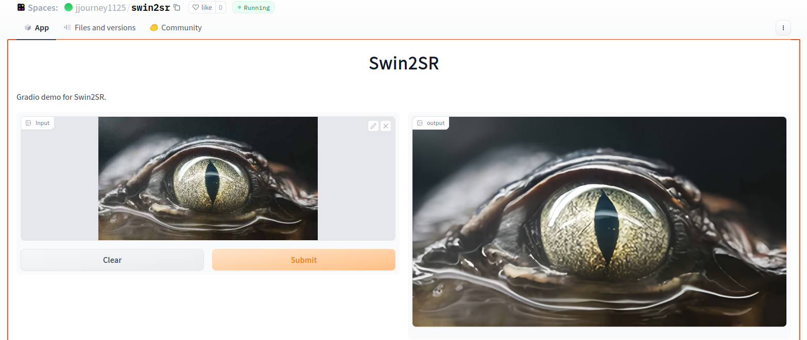
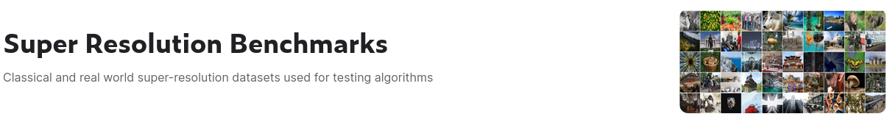

# Swin2SR @ ECCV 2022 AIM Workshop

## [Swin2SR: SwinV2 Transformer for Compressed Image Super-Resolution and Restoration](https://arxiv.org/abs/2209.11345)

[](https://arxiv.org/abs/2209.11345)

[ <a href="https://colab.research.google.com/drive/1paPrt62ydwLv2U2eZqfcFsePI4X4WRR1?usp=sharing"></a>](https://colab.research.google.com/drive/1paPrt62ydwLv2U2eZqfcFsePI4X4WRR1?usp=sharing)
[](https://huggingface.co/spaces/jjourney1125/swin2sr)
[](https://replicate.com/cjwbw/japanese-stable-diffusion)
[ <a href="https://www.kaggle.com/code/jesucristo/super-resolution-demo-swin2sr-official/"></a>](https://www.kaggle.com/code/jesucristo/super-resolution-demo-swin2sr-official/)


<br>

[Marcos V. Conde](https://scholar.google.com/citations?user=NtB1kjYAAAAJ&hl=en), [Ui-Jin Choi](https://scholar.google.com/citations?user=MMF5LCoAAAAJ&hl=en), [Maxime Burchi](https://scholar.google.com/citations?user=7S_l2eAAAAAJ&hl=en), [Radu Timofte](https://scholar.google.com/citations?user=u3MwH5kAAAAJ&hl=en)


[Computer Vision Lab, CAIDAS, University of Würzburg](https://www.informatik.uni-wuerzburg.de/computervision/home/)

[MegaStudyEdu, South Korea](https://megastudy.net/)

**We are looking for collaborators!  Collaborator를 찾고 있습니다!** 🇬🇧 🇪🇸 🇰🇷 🇫🇷 🇷🇴 🇩🇪 🇨🇳

------------------

**News 🚀🚀**

- [10/2022] Demos on Kaggle, Collab and Huggingface Spaces 🤗 are ready!
- [09/2022] Ongoing website and multiple demos creation. Feel free to contact us. Paper will be presented at the [Advances in Image Manipulation (AIM) workshop](https://data.vision.ee.ethz.ch/cvl/aim22/), ECCV 2022, Tel Aviv.

------------------

This is the official repository and PyTorch implementation of Swin2SR. We provide the supplementary material, code, pretrained models and demos. Swin2SR represents a possible improvement of the famous [SwinIR](https://github.com/JingyunLiang/SwinIR/) by [Jingyun Liang](https://jingyunliang.github.io/) (kudos for such an amazing contribution ✋). Our model achieves state-of-the-art performance in:

- classical, lighweight and real-world image super-resolution (SR)
- color JPEG compression artifact reduction
- compressed input super-resolution: top solution at the "[AIM 2022 Challenge on Super-Resolution of Compressed Image and Video](https://codalab.lisn.upsaclay.fr/competitions/5076)" organized by [Ren Yang](https://scholar.google.de/citations?hl=en&user=3NgkOp0AAAAJ) and [Radu Timofte](https://scholar.google.de/citations?user=u3MwH5kAAAAJ&hl=en)


<p align="center">
  <a href="https://huggingface.co/spaces/jjourney1125/swin2sr"></a>
</p>


<details>
<summary><b>Click here to read a quick summary / ABSTRACT </b></summary>
Compression plays an important role on the efficient transmission and storage of images and videos through band-limited systems such as streaming services, virtual reality or videogames. However, compression unavoidably leads to artifacts and the loss of the original information, which may severely degrade the visual quality. For these reasons, quality enhancement of compressed images has become a popular research topic. While most state-of-the-art image restoration methods are based on convolutional neural networks, other transformers-based methods such as SwinIR, show impressive performance on these tasks.

In this paper, we explore the novel Swin Transformer V2, to improve SwinIR for image super-resolution, and in particular, the compressed input scenario. Using this method we can tackle the major issues in training transformer vision models, such as training instability, resolution gaps between pre-training and fine-tuning, and hunger on data. We conduct experiments on three representative tasks: JPEG compression artifacts removal, image super-resolution (classical and lightweight), and compressed image super-resolution. Experimental results demonstrate that our method, Swin2SR, can improve the training convergence and performance of SwinIR, and is a top-5 solution at the "AIM 2022 Challenge on Super-Resolution of Compressed Image and Video". 

</details>


------------------

#### Contents

1. [Training](#training)
1. [Results](#results) | [Demos](#demos) | [Testing](#testing)
1. [Citation and Acknowledgement](#citation-and-acknowledgement) | [Contact](#contact)

---------------------------------------------------

## Training

The training code is at [KAIR](https://github.com/cszn/KAIR/). We follow the same training setup as [SwinIR](https://github.com/JingyunLiang/SwinIR/) by [Jingyun Liang](https://jingyunliang.github.io/). We are working on KAIR integration 👀
More details about the training setup in our [paper](https://arxiv.org/abs/2209.11345).


<details>
<summary><b>Why moving to Swin Transformer V2 ??</b></summary>


Especially in the case of lightweight super-resolution, we noticed how our model convergence was approximately x2 faster using the same experimental setup as SwinIR. We provide the details in the paper Section 3 and 4.2
</details>

<p align="center">
  <a href="https://arxiv.org/abs/2209.11345"></a>
</p>


<br>

Please check our **[demos](#demos) ready to run** 🚀
The **pre-trained model weights** are [here](https://github.com/mv-lab/swin2sr/releases).


------

## Results

We achieved state-of-the-art performance on classical, lightweight and real-world image Super-Resolution (SR), JPEG compression artifact reduction, and compressed input super-resolution. We use mainly the DIV2K Dataset and Flickr2K datasets for training, and for testing:  RealSRSet, 5images/Classic5/Set5, Set14, BSD100, Urban100 and Manga109  

🌎 **[All visual results of Swin2SR can be downloaded here](https://github.com/mv-lab/swin2sr/releases)**. We also provide links to download the original datasets.
More details in our [paper](https://arxiv.org/abs/2209.11345).

<br>

|Compressed inputs | Swin2SR output|
|       :---       |     :---:     |
|  |  |
|  |  |
|  |  |


<br>

🌎 **[All the qualitative samples can be downloaded here](https://github.com/mv-lab/swin2sr/releases)**


### Basic inference setup


1. create a folder `inputs` and put there the input images. The model expects low-quality and low-resolution JPEG compressed images.

2. select `--scale` standard is 4, this means we will increase the resolution of the image x4 times. For example for a 1MP image (1000x1000) we will upscale it to near 4K (4000x4000).

3. run our model using `main_test_swin2sr.py` and `--save_img_only`. The pre-trained model weights are included in [our repo](https://github.com/mv-lab/swin2sr), you can download them from [here](https://github.com/mv-lab/swin2sr/releases) or check the repo [releases](https://github.com/mv-lab/swin2sr/releases). It is important to select the proper `--task`, by default we do compressed input super-resolution `compressed_s`.

4. we process the images in `inputs/` and the outputs are stored in `results/swin2sr_{TASK}_x{SCALE}` where TASK and SCALE are the selected options. You can just navigate through `results/`


```
python main_test_swin2sr.py --task compressed_sr --scale 4 --training_patch_size 48 --model_path model_zoo/swin2sr/Swin2SR_CompressedSR_X4_48.pth  --folder_lq ./inputs --save_img_only
```

to **reproduce results**, calculate metrics and further evaluation, please check the following section [Testing](#testing).

------

## Demos


🔥 🚀 ✅ **[Kaggle kernel demo](https://www.kaggle.com/code/jesucristo/super-resolution-demo-swin2sr-official/) ready to run!** easy to follow includes testing for multiple SR applications.

<details>
<summary>Clicke here to see how the Kaggle demo looks like</summary>
<p align="center">

</p>
</details>

<br>

[Super-Resolution Demo Swin2SR Official](https://www.kaggle.com/code/jesucristo/super-resolution-demo-swin2sr-official/) is also available in [<a href="https://colab.research.google.com/drive/1paPrt62ydwLv2U2eZqfcFsePI4X4WRR1?usp=sharing">Google Colab </a>](https://colab.research.google.com/drive/1paPrt62ydwLv2U2eZqfcFsePI4X4WRR1?usp=sharing)

We also have an **interactive demo, no login required!** in [Huggingface Spaces 🤗](https://huggingface.co/spaces/jjourney1125/swin2sr) just click and upload images.




We are working on more interactive demos 👀 Contact us if you have ideas!


----
<br>

## Testing

The **original evaluation datasets** can be downloaded from the following [Kaggle Dataset](https://www.kaggle.com/datasets/jesucristo/super-resolution-benchmarks)

 

**Classical image super-resolution (SR)**
Set5 + Set14 + BSD100 + Urban100 + Manga109 - [download here](https://drive.google.com/drive/folders/1B3DJGQKB6eNdwuQIhdskA64qUuVKLZ9u)

**real-world image SR**
RealSRSet and 5images- [download here](https://github.com/JingyunLiang/SwinIR/releases/download/v0.0/RealSRSet+5images.zip)

**grayscale/color JPEG compression artifact reduction**
Classic5 +LIVE1 - [download here](https://github.com/cszn/DnCNN/tree/master/testsets)

We follow the same evaluation setup as [SwinIR](https://github.com/JingyunLiang/SwinIR/) by [Jingyun Liang](https://jingyunliang.github.io/) 


🚀 You can check this evaluation process (and the followinf points) in our interactive kernel **[Official Swin2SR Demo Results](https://www.kaggle.com/jinssaa/official-swin2sr-demo-results/)**


<br>


### ClassicalSR 
```
python main_test_swin2sr.py --task classical_sr --scale 2 --training_patch_size 64 --model_path model_zoo/swin2sr/Swin2SR_ClassicalSR_X2_64.pth --folder_lq testsets/Set5/LR_bicubic/X2 --folder_gt testsets/Set5/HR

python main_test_swin2sr.py --task classical_sr --scale 4 --training_patch_size 64 --model_path model_zoo/swin2sr/Swin2SR_ClassicalSR_X4_64.pth --folder_lq testsets/Set5/LR_bicubic/X4 --folder_gt testsets/Set5/HR
```

### Lightweight
```
python main_test_swin2sr.py --task lightweight_sr --scale 2 --training_patch_size 64 --model_path model_zoo/swin2sr/Swin2SR_Lightweight_X2_64.pth --folder_lq testsets/Set5/LR_bicubic/X2 --folder_gt testsets/Set5/HR
```

### RealSR
```
python main_test_swin2sr.py --task real_sr --scale 4 --model_path model_zoo/swin2sr/Swin2SR_RealworldSR_X4_64_BSRGAN_PSNR.pth --folder_lq testsets/RealSRSet+5images
```

### CompressedSR
```
python main_test_swin2sr.py --task compressed_sr --scale 4 --training_patch_size 48 --model_path model_zoo/swin2sr/Swin2SR_CompressedSR_X4_48.pth --folder_gt path/to/DIV2K_Valid_HR --folder_lq /path/to/DIV2K_Valid_LR/Compressed_X4
```

### JPEG Compression Artifact Reduction, Dynamic, GrayScale
```
python main_test_swin2sr.py --task jpeg_car --jpeg 10 --model_path model_zoo/swin2sr/Swin2SR_Jpeg_dynamic.pth --folder_gt /path/to/classic5
python main_test_swin2sr.py --task jpeg_car --jpeg 20 --model_path model_zoo/swin2sr/Swin2SR_Jpeg_dynamic.pth --folder_gt /path/to/classic5
python main_test_swin2sr.py --task jpeg_car --jpeg 30 --model_path model_zoo/swin2sr/Swin2SR_Jpeg_dynamic.pth --folder_gt /path/to/classic5
python main_test_swin2sr.py --task jpeg_car --jpeg 40 --model_path model_zoo/swin2sr/Swin2SR_Jpeg_dynamic.pth --folder_gt /path/to/classic5
```

------


## Related Work

**[SwinIR: Image Restoration Using Swin Transformer](https://arxiv.org/abs/2108.10257) by Liang et al, ICCVW 2021.**

**[AISP: AI Image Signal Processing](https://github.com/mv-lab/AISP) by Marcos Conde, Radu Timofte and collaborators, 2022.**

[AIM 2022 Challenge on Super-Resolution of Compressed Image and Video](https://arxiv.org/abs/2208.11184) organized by Ren Yang.

[Swin Transformer V2: Scaling Up Capacity and Resolution](https://arxiv.org/abs/2111.09883) by Liu et al, CVPR 2022.


-----------------

## Citation and Acknowledgement

```
@inproceedings{conde2022swin2sr,
  title={{S}win2{SR}: SwinV2 Transformer for Compressed Image Super-Resolution and Restoration},
  author={Conde, Marcos V and Choi, Ui-Jin and Burchi, Maxime and Timofte, Radu},
  booktitle={Proceedings of the European Conference on Computer Vision (ECCV) Workshops},
  year={2022}
}

@article{liang2021swinir,
  title={SwinIR: Image Restoration Using Swin Transformer},
  author={Liang, Jingyun and Cao, Jiezhang and Sun, Guolei and Zhang, Kai and Van Gool, Luc and Timofte, Radu},
  journal={arXiv preprint arXiv:2108.10257},
  year={2021}
}
```

This project is released under the Apache 2.0 license. The codes are heavily based on [Swin Transformer](https://github.com/microsoft/Swin-Transformer) and [SwinV2 Transformer](https://github.com/microsoft/Swin-Transformer) by [Ze Liu](https://scholar.google.com/citations?hl=en&user=9DbprTIAAAAJ). We also refer to codes in [KAIR](https://github.com/cszn/KAIR), [BasicSR](https://github.com/xinntao/BasicSR) and [SwinIR](https://github.com/JingyunLiang/SwinIR/). Please also follow their licenses. Thanks for their awesome works.


## Contact

Marcos Conde (marcos.conde-osorio@uni-wuerzburg.de) and Ui-Jin Choi ( choiuijin1125@gmail.com) are the contact persons. Please add in the email subject "swin2sr".
